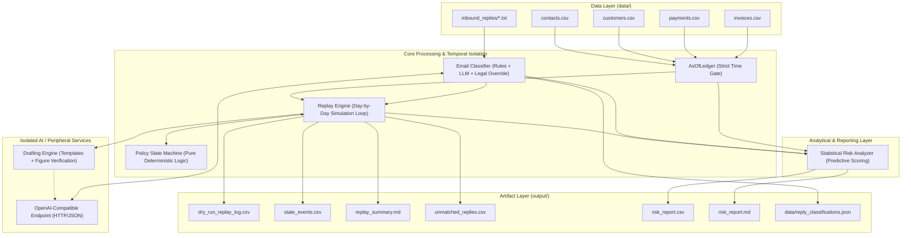
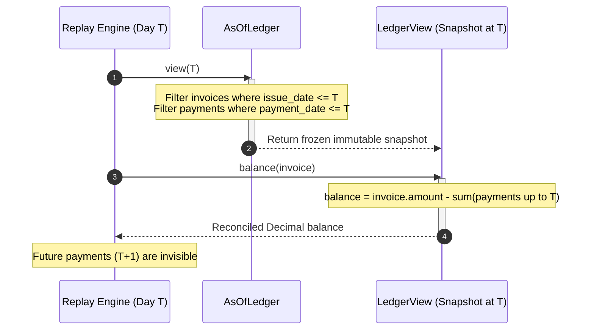
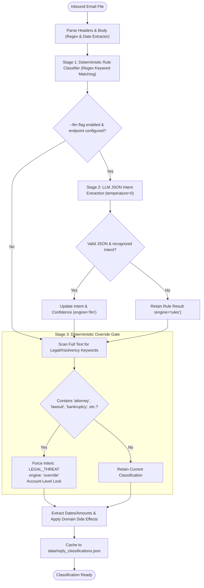
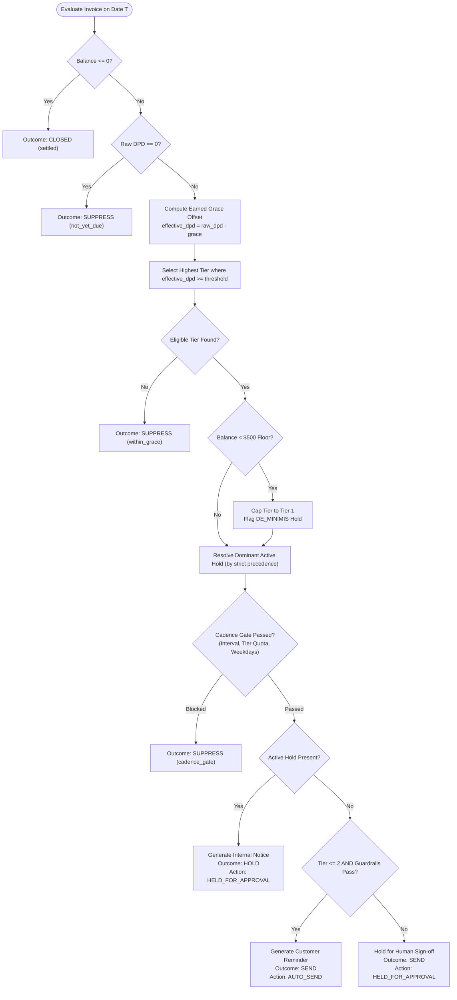
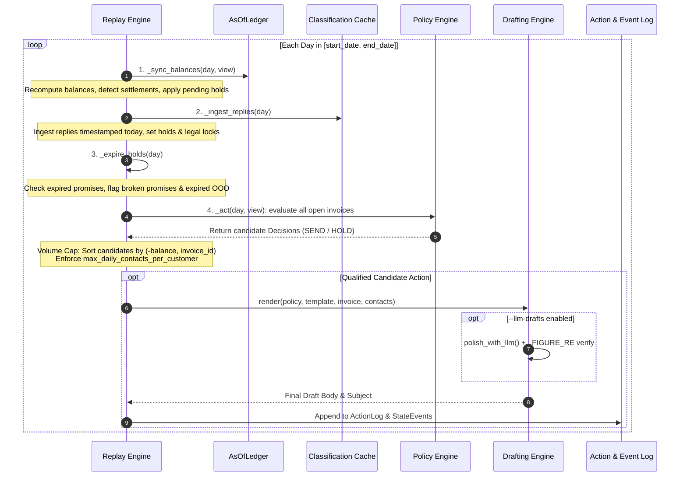
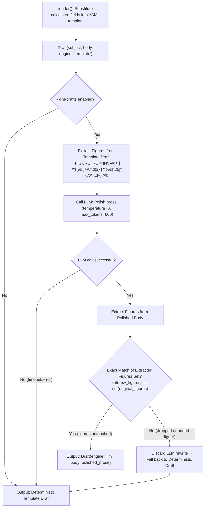

# System Architecture Document

A comprehensive technical reference detailing the architecture, execution model, state machine, and data flow of the `fs-collections-agent` system.

---

## 1. High-Level System Architecture

The collections agent operates as a **deterministic, offline-first AR operations engine** supported by lightweight, isolated LLM helpers. The core design strictly decouples financial state, escalation logic, and temporal simulation from external AI dependencies.



---

## 2. Component Taxonomy & Module Structure

The package is partitioned into single-responsibility modules:

| Module | Responsibility | Invariants & Constraints |
| :--- | :--- | :--- |
| `src/fs_collections_agent/ledger.py` | As-of ledger gating & balance tracking | Read-only time travel; strictly forbids leaking post-`as_of` data |
| `src/fs_collections_agent/models.py` | Typed domain dataclasses and enums | `Decimal` money arithmetic; pure `datetime.date` objects; zero IO |
| `src/fs_collections_agent/email_classifier.py` | Inbound email intent extraction | Rules-first; optional LLM NLU; post-LLM deterministic legal override |
| `src/fs_collections_agent/policy_engine.py` | Escalation state machine & hold rankings | Pure functions; zero IO; deterministic single-path decisions |
| `src/fs_collections_agent/replay_engine.py` | 532-day sequential simulation | Step order: balance sync $\rightarrow$ reply ingest $\rightarrow$ hold expiry $\rightarrow$ act |
| `src/fs_collections_agent/drafting.py` | Template rendering & prose rewording | Regex figure verification gate (`_FIGURE_RE`); fail-soft fallback |
| `src/fs_collections_agent/risk_analyzer.py` | Open invoice late-payment risk model | Empirical statistics (median, stdev, exposure); zero opaque ML |
| `src/fs_collections_agent/llm.py` | Lazy OpenAI-compatible HTTP client | Fail-soft; returns `LLMResult(error=...)`; never raises exceptions |
| `src/fs_collections_agent/config.py` | YAML configuration parsing & validation | Loads escalation thresholds, grace settings, cadence, and templates |
| `src/fs_collections_agent/cli.py` | Single CLI entry point | Coordinates commands: `all`, `replay`, `classify`, `risk` |

---

## 3. Strict Temporal Containment (`AsOfLedger`)

To guarantee historical fidelity and prevent data leakage, the agent views the financial ledger exclusively through temporal slices generated by `AsOfLedger.view(as_of)`.



### Invariants Enforced:
1. **Zero Future Leakage:** An evaluation on simulated date `2025-06-01` has no programmatic access to payments or invoices created on `2025-06-02`.
2. **Reconciled Balances:** Invoice `status` columns in source CSVs are never trusted for logic. Balances are derived dynamically:
   $$\text{Balance}_T = \text{Invoice Amount} - \sum \{ \text{Payment Amount} \mid \text{Payment Date} \le T \}$$
3. **Discrepancy Auditing:** Any invoice marked `open` in external data with a computed zero balance triggers a `LEDGER_DISCREPANCY` state event.

---

## 4. Inbound Email Classification Pipeline

Inbound customer replies in `data/inbound_replies/` are processed through a 3-tier classification pipeline designed with defense-in-depth:



### Key Pipeline Behaviors:
* **Stage 1 (Rules Baseline):** Compiled regex patterns evaluate the text against known intent patterns (e.g. `PROMISE_TO_PAY`, `DISPUTE`, `OUT_OF_OFFICE`).
* **Stage 2 (LLM Enhancement):** If `--llm` is active, prompts the model for JSON `{"intent": "...", "confidence": 0.0-1.0}`.
* **Stage 3 (Post-LLM Safety Override):** Scans for legal risk indicators. Even if an LLM incorrectly labels an email as a promise to pay, Stage 3 forces `LEGAL_THREAT` (`engine="override"`), locking the account immediately.

---

## 5. Escalation Policy State Machine

On each simulated day, every open overdue invoice is evaluated by `policy_engine.evaluate()`. The evaluation follows an immutable priority ladder:



### Policy Tiers:
| Tier | DPD Threshold | Primary Recipient | CC Recipient | Action Type | Intent |
| :---: | :---: | :--- | :--- | :---: | :--- |
| **Tier 1** | 3 days | AP Contact | None | `AUTO_SEND` | Gentle operational nudge |
| **Tier 2** | 14 days | AP Contact | Customer Controller | `AUTO_SEND` | Firm reminder with controller visibility |
| **Tier 3** | 30 days | Customer Controller | Internal Account Director | `HELD_FOR_APPROVAL` | Formal demand to budget holder |
| **Tier 4** | 45+ days | Customer CEO / Owner | Internal Account Director | `HELD_FOR_APPROVAL` | Executive escalation & relationship review |

---

## 6. Hold Ranking & Conflict Resolution

Multiple hold conditions may apply to an account simultaneously. To eliminate ambiguity, holds are resolved using a **strict ordinal precedence hierarchy**:

```mermaid
graph LR
    H1["1. LEGAL_HOLD"] --> H2["2. DISPUTE"]
    H2 --> H3["3. PAYMENT_IN_FLIGHT"]
    H3 --> H4["4. PROMISE_TO_PAY"]
    H4 --> H5["5. PAYMENT_PLAN_PENDING"]
    H5 --> H6["6. REISSUE_REQUIRED"]
    H6 --> H7["7. INFO_REQUEST"]
    H7 --> H8["8. PORTAL_SLA"]
    H8 --> H9["9. RELATIONSHIP_RISK"]
    H9 --> H10["10. UNREADABLE_REPLY"]
    H10 --> H11["11. CADENCE_EXHAUSTED"]
    H11 --> H12["12. DE_MINIMIS"]
    H12 --> H13["13. OOO_DEFER"]
```



### Hold Properties:
* **Absorbing Holds:** `LEGAL_HOLD`, `DISPUTE`, and `RELATIONSHIP_RISK` have no automatic expiration date (`expires_on = None`). Only a human operator can release them.
* **Transient Holds:** `PROMISE_TO_PAY`, `PAYMENT_IN_FLIGHT`, and `OOO_DEFER` carry explicit expiration dates. When the promised date passes without full settlement, the hold expires and the engine logs a `PROMISE_BROKEN` state event.
* **Notification Deduping:** The engine records `(hold_reason, tier)` pairs in `InvoiceState.hold_notices`. A long-running hold generates exactly **one** handover note per tier instead of repeatedly alerting human reviewers every week.

---

## 7. Daily Replay Simulation Loop

The `ReplayEngine` walks through each calendar day sequentially from `2025-03-13` to `2026-08-26` (532 days). The execution order inside each day's step is strictly deterministic:



---

## 8. Drafting Engine & Figure Invariant Verification

When generating outbound copy, financial accuracy is guaranteed by construction. An LLM may smooth prose, but cannot alter numerical facts.



---

## 9. Statistical Risk Scoring Engine

Rather than relying on an uninterpretable machine learning model for a small cohort (12 customers, 432 invoices), the `RiskAnalyzer` computes an exposure-weighted, empirical risk score $\in [0.0, 1.0]$.

### Scoring Formulation:
$$\text{Risk Score} = \sum_{k} w_k \cdot f_k$$

Where factor weights $w_k$ are defined in `config/escalation_policy.yaml`:

| Factor ($f_k$) | Description | Normalization / Basis |
| :--- | :--- | :--- |
| **Lateness Share** | Fraction of historical invoices paid past due | $\frac{\text{settled late}}{\text{total settled}}$ |
| **Median Lateness** | Trailing median days past due | $\text{clamp}_{0..1}\left(\frac{\text{median late}}{60}\right)$ |
| **Volatility** | Standard deviation of payment timing | $\text{clamp}_{0..1}\left(\frac{\text{std dev}}{30}\right)$ |
| **Current Aging** | Aging of this specific open invoice | $\text{clamp}_{0..1}\left(\frac{\text{effective dpd}}{45}\right)$ |
| **Active Blocker** | Dispute, PO mismatch, plan request | $1.0$ if blocked, else $0.0$ |
| **Account Blocker** | Legal lock or relationship complaint | $1.0$ if account locked, else $0.0$ |
| **Undeliverable** | Known dead mailbox for AP contact | $1.0$ if bouncing, else $0.0$ |
| **Exposure Share** | Invoice balance relative to customer total | $\frac{\text{invoice balance}}{\text{customer total open}}$ |

### Risk Bands:
* **High ($\ge 0.55$):** Severe default risk, unresolvable blocker, or persistent chronic delinquency.
* **Medium ($0.30 - 0.54$):** Moderate delay anticipated, volatile payer, or mid-tier aging.
* **Low ($< 0.30$):** High confidence of near-term payment within established historical patterns.

---

## 10. Data Artifacts & Output Specifications

At the conclusion of a run, the system emits verifiable, human-readable and machine-readable artifacts into `output/`:

```
output/
├── dry_run_replay_log.csv     # Every action the agent would have taken across 532 days
├── state_events.csv           # Audit log of holds, expirations, partial payments, bounces
├── unmatched_replies.csv      # Unparseable emails or unrecognized invoice references
├── replay_summary.md          # Markdown executive summary of tier volumes and hold counts
├── risk_report.csv            # Structured tabular risk ranking for all open invoices
└── risk_report.md             # Natural-language risk digest with per-invoice rationales
```

### Replay Log Schema (`dry_run_replay_log.csv`):
```text
1.  date                      - Simulation date (YYYY-MM-DD)
2.  invoice_id                - Target invoice identifier
3.  customer_name             - Client legal name
4.  recipient_email           - Destination email(s), semicolon-delimited
5.  recipient_tier            - Tier classification (e.g. 'T1 Operational nudge')
6.  action_type               - AUTO_SEND or HELD_FOR_APPROVAL
7.  hold_reason               - Dominant hold reason if held, else empty
8.  message_body              - Complete rendered email text
9.  subject                   - Rendered subject line
10. recipient_role            - Contact role (ap_contact, controller, etc.)
11. cc_emails                 - CC recipients, semicolon-delimited
12. days_past_due             - Raw calendar days past due
13. effective_days_past_due   - DPD adjusted for earned predictability grace
14. balance                   - Exact remaining balance (Decimal string)
15. template                  - Policy template identifier
16. trigger_reason            - Natural language trigger condition
17. reminder_seq              - Sequence counter for this invoice
18. engine                    - Draft engine ('template' or 'llm')
```
